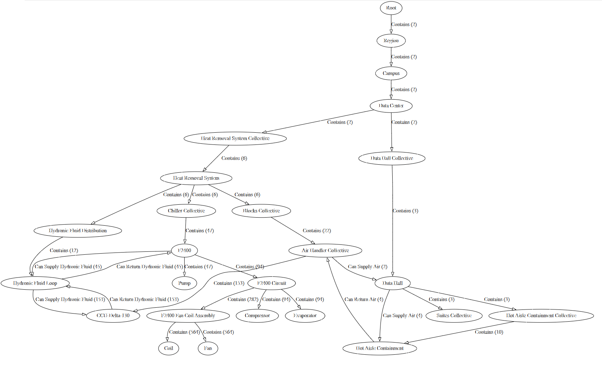

# Topology Extraction from a SMIP Model

<b>Fig.1 - Sample Topology</b>

## Some Benefits

- topologies can keep AI bots from making stuff up
- topologies extracted using this script are a reflection of what is modeled. modeling errors and inconsistencies will stick out.
- a topology is an excelent communication tool of how things are meant to be modeled

## Code First vs. Model First

One could argue that in object-oriented (OO) programming (code first) things allways yield to a topology, because in OO usage and yielding to a topology is implied.

If your code is scripted in nature (javascript or python...), you could reflect on the model to infer a topology for above stated purposes.

In the SMIP it is very easy to simply model away (model first). It would be good practice to reflect on this after a while to discover the rules followed, review them, and then enforce such topological rules more strongly moving forward.