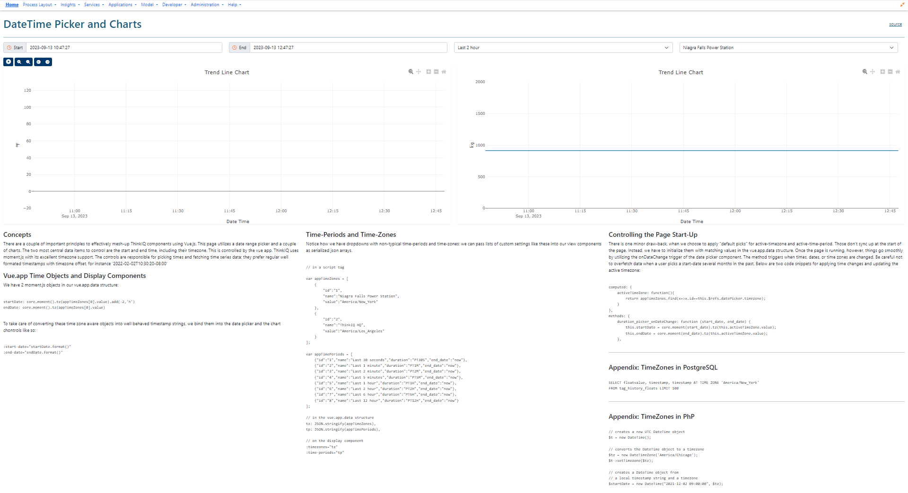

# Vue.js, TimeZones, Charts , and DateTime Picker

## Concepts



There are a couple of important principles to effectively mesh-up ThinkIQ components using Vue.js. [This script](./01_Timestamps_with_Timezones_with_Controls.php) utilizes a date range picker and a couple of charts. The two most central data items to control are the start and end time, including their timezone. This is controlled by the vue app. ThinkIQ uses moment.js with its excellent timezone support. The controls are responsible for picking times and fetching time series data; they prefer regular well formated timestamps with timezone offset, for instance '2022-02-02T10:30:20-08:00'.

## Vue.app Time Objects and Display Components

We have 2 moment.js objects in our vue.app.data structure:

```
startDate: core.moment().tz(appTimeZones[0].value).add(-2,'h') 
endDate: core.moment().tz(appTimeZones[0].value)
```

To take care of converting these time zone aware objects into well behaved timestamp strings, we bind them into the date picker and the chart chontrols like so:

```
:start-date="startDate.format()"
:end-date="endDate.format()"
```

## Time-Periods and Time-Zones

Notice how we have dropdowns with non-typical time-periods and time-zones: we can pass lists of custom settings like these into our view components as serialized json arrays.

```
// in a script tag

var appTimeZones = [
    {
        "id":"1",
        "name":"Niagra Falls Power Station",
        "value":"America/New_York"
    },
    {
        "id":"2",
        "name":"ThinkIQ HQ",
        "value":"America/Los_Angeles"
    }
];

var appTimePeriods = [
    {"id":"1","name":"Last 30 seconds","duration":"PT30S","end_date":"now"},
    {"id":"2","name":"Last 1 minute","duration":"PT1M","end_date":"now"},
    {"id":"3","name":"Last 2 minute","duration":"PT2M","end_date":"now"},
    {"id":"4","name":"Last 5 minutes","duration":"PT5M","end_date":"now"},
    {"id":"5","name":"Last 1 hour","duration":"PT1H","end_date":"now"},
    {"id":"6","name":"Last 2 hour","duration":"PT2H","end_date":"now"},
    {"id":"7","name":"Last 6 hour","duration":"PT6H","end_date":"now"},
    {"id":"8","name":"Last 12 hour","duration":"PT12H","end_date":"now"}
];

// in the vue.app.data structure
tz: JSON.stringify(appTimeZones),
tp: JSON.stringify(appTimePeriods),

// on the display component
:timezones="tz" 
:time-periods="tp"
```

## Controlling the Page Start-Up

There is one minor draw-back, when we choose to apply "default picks" for active-timezone and active-time-period. Those don't sync up at the start of the page. Instead, we have to initialize them with matching values in the vue.app.data structure. Once the page is running, however, things go smoothly by utilizing the onDateChange trigger of the date picker component. The method triggers when times, dates, or time zones are changed. Be careful not to overfetch data when a user picks a start-date several months in the past. Below are two code snippets for applying time changes and updating the active timezone:

```
computed: {
    activeTimeZone: function(){
        return appTimeZones.find(x=>x.id==this.$refs.datePicker.timezone);
    }
},
methods: {
    duration_picker_onDateChange: function (start_date, end_date) {
        this.startDate = core.moment(start_date).tz(this.activeTimeZone.value);
        this.endDate = core.moment(end_date).tz(this.activeTimeZone.value);
    },
```            

## Appendix: TimeZones in PostgreSQL

```
SELECT floatvalue, timestamp, timestamp AT TIME ZONE 'America/New_York' 
FROM tag_history_floats LIMIT 100
```            

## Appendix: TimeZones in PhP

```
// creates a new UTC DateTime object
$t = new DateTime();

// converts the DateTime object to a timezone
$tz = new DateTimeZone('America/Chicago');
$t->setTimezone($tz);

// creates a DateTime object from
// a local timestamp string and a timezone
$startDate = new DateTime("2021-12-02 09:00:00", $tz);
```