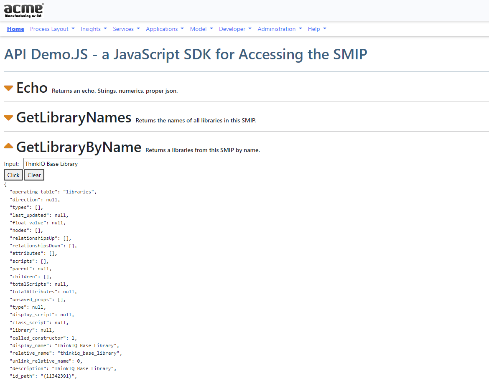

# Topic 06 - OOP Techniques and Project Organization

## Using API Style Data Retrieval for Browser Script

We have 2 small samples in this section.

1. A PHP file that has access to the php utilities and therefor all our model data. The file can be called like a restful endpoint and return data depending on the provided function and argument parameter.

1. The first example still leaves a lot of clutter in the browser script. This can be cleaned up further by lifting out the fetch request sections and packaging them as a dedicated javascript sdk. The resulting browser script to test the api can be conviniently structured as a documentation page, below.

